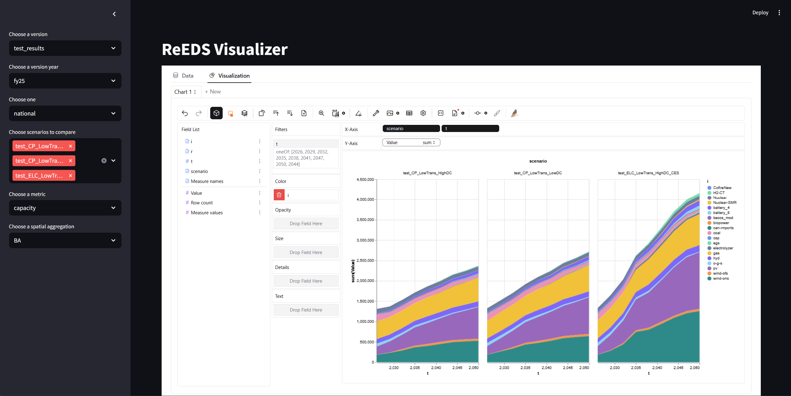

# reeds-visualizer
A Tableau-like platform for visualizing data from the ReEDS model leveraging [`PyGWalker`](https://kanaries.net/pygwalker)
and [`streamlit`](https://docs.streamlit.io/).



# Requirements

Users must have the following installed:

- [git](https://git-scm.com/downloads)
- A python distribution ([Anaconda](https://www.anaconda.com/download/success) or [Mamba](https://mamba.readthedocs.io/en/latest/installation/mamba-installation.html))

# Environment Set Up

1. Open a terminal window (terminal on a Unix system or Command Prompt on Windows).

2. Clone the repository by typing (or copy-pasting) the following command:

```bash
git clone https://github.com/ucsusa/reeds-visualizer.git
```

3. Navigate into the newly created directory with
```bash
cd reeds-visualizer
```

4. Create a new Python environment with (and follow the prompts)
```bash
conda env create
```

5. Activate the newly created Python environment
```bash
conda activate reeds-viz
```

6. Start the visualizer, which will open a new browser window, using
```bash
streamlit run visualizer.py
```

# Pulling recent changes

When issues or tickets lead to code changes, those changes will not automatically be present on
a local copy of the repository. 

In order to pull down the changes, make sure you are the in `reeds-visualizer` working directory
in your command prompt or terminal window. Then you can use the following command (assuming the desired changes are on the main branch):

```bash
git pull origin main
```

> [!NOTE]
> You cannot pull changes or execute any commands in the same session that is running the visualizer.
> In other words, you must shut down the visualizer, pull the changes, and restart it for the changes > to take effect.


